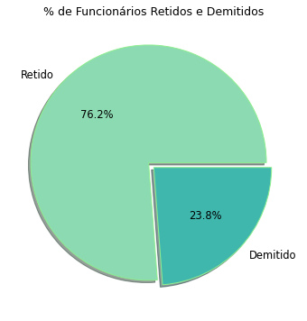
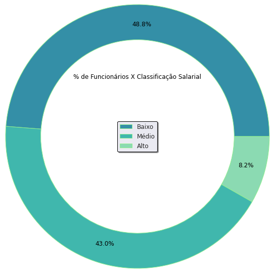
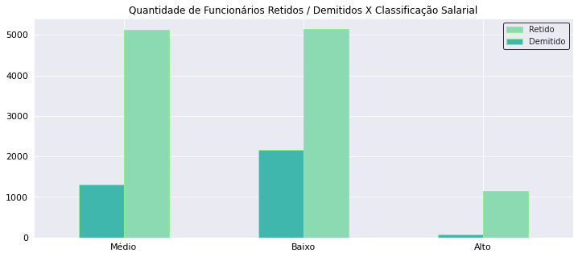
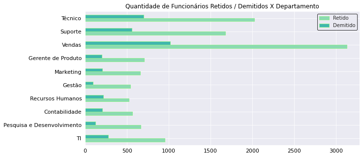
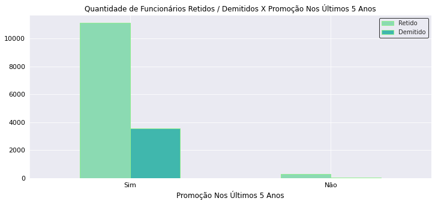
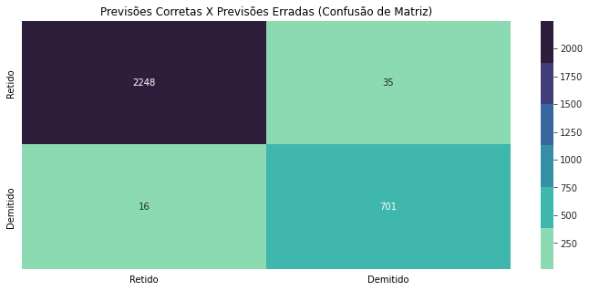

# Recursos Humanos (Modelo de Propensão)
### Projeto de Machine Learning

 Suponhamos hipoteticamente que o gerente do setor de RH (Recursos Humanos) queira que façamos uma análise descritiva e preditiva que ajude-o à prever quais são os fatores que influenciam na demissão ou na retenção de um funcionário na empresa, os objetivos do gerente ao obter tal análise são **(1)** implementar medidas no setor de RH que possam evitar a demissão futura dos funcionários e também **(2)** ter um modelo preditivo que o ajude a prever probabilisticamente a propensão de um funcionário demitir-se ou não da empresa, com base em outras variáveis influenciáveis.

Com base nos objetivos hipotéticos citados acima, realizei uma limpeza e uma análise exploratória no conjunto de dados de RH de uma empresa fictícia, e em subsequência apliquei um algoritmo de floresta aleatória para obter um modelo preditivo que ajudasse a prever a propensão de um funcionário da empresa demitir-se ou não no futuro.


Para iniciar o projeto, importei as bibliotecas Pandas, Numpy, Seaborn e Matplotlib para realizar o processo de tratamento, manipulação e visualização de dados:

```
 import pandas as pd 
 import numpy as np
 import matplotlib.pyplot as plt
 import seaborn as sns
 %matplotlib inline
  ```
Consequentemente, importei o dataset de RH com a aplicação do método .read_csv da biblioteca Pandas:

```
# Importação do conjunto de dados que será usado:

df = pd.read_csv('/content/drive/MyDrive/HR_comma.csv')
```
Após a importação e a visualização breve do dataset, avancei para a primeira etapa do projeto analítico:

### Tratamento de dados:

A primeira informação que obtive sobre o conjunto de dados usado é que há 14 mil linhas e 10 colunas contidas no dataset, além de termos 2 colunas do tipo float (número decimal), 6 do tipo int (número inteiro) e 2 do tipo object (texto).

Após a verificação dessas informações primais, realizei dois processos simples e breves de limpeza nos dados:

* Renomeação das colunas:

Mudei o formato textual do nome das colunas, para que todas colunas fossem registradas textualmente com letras minúsculas:

```
df.columns = df.columns.str.lower()
```

* Dados nulos:

Apliquei o método .isna().sum() para saber a quantidade de dados ausentes por coluna, felizmente foi verificável que não há nenhuma coluna com dados nulos presentes.

Concluído o processo de tratamento dos dados, comecei a focar no entendimento dos dados através da análise exploratória, para em sequência aplicar o modelo de machine learning que pudesse prever a propensão de demissão ou retenção dos funcionários da empresa.

### Análise exploratória de dados (EDA):

Antes de iniciar a etapa de análise exploratória, é indispensável saber sobre o quê cada coluna se trata:

* satisfaction_level: Taxa de satisfação do funcionário com a empresa (entre a faixa de 0 e 1).
* last_evaluation: Última avaliação de desempenho que os funcionários receberam (entre a faixa de 0 e 1).
* number_project: Número de projetos que os funcionários participaram na empresa.
* average_montly_hours: Média de horas de trabalho que cada funcionário gastou na empresa mensalmente.
* time_spend_company: Anos de trabalho que cada funcionário teve na empresa.
* work_acident: Informação sobre acidente de trabalho sofrido por cada funcionário (0 para não e 1 para sim).
* left: Informação sobre o fato de cada funcionário ter sido demitido ou não da empresa (0 para não e 1 para sim).
* promotion_last_5_years: Promoção na empresa nos últimos 5 anos para cada funcionário (0 para não e 1 para sim).
* department: Departamento que cada funcionário trabalha na empresa.
* salary: Classificação salarial de cada funcionário entre baixo, médio e alto salário.

Após ter explicitado o quê cada variável significa, comecei tal análise com a seguinte questão:

**(1)** **Qual é a quantidade de funcionários demitidos e retidos da empresa?**

Com essa questão, quis saber a quantidade de funcionários que foram demitidos e a quantidade de funcionários que continuam na empresa, e como resposta obtive que 11 mil funcionários continuam na empresa e outros 3 mil funcionários foram demitidos da empresa, percentualmente expus tal informação com um gráfico de pizza:



Notavelmente, observamos que mais de 3 / 4 dos funcionários continuam na empresa e somente 23 % dos funcionários foram demitidos.

À partir dessa informação inicial, quis saber a quantidade de funcionário por classificação salarial, para depois obter mais insights sobre o dataset:

**(2)** **Qual é a porcentagem de funcionários por classificação salarial?**

Com um gráfico de rosca expus a resposta informacional para a questão acima:



Como é observável acima, a suma maioria de 48 % dos funcionários recebem um salário considerado baixo, 43 % recebem um salário consideravelmente médio, e por fim uma minoria ínfima de funcionários recebem um salário considerado alto.

Após saber a quantidade de funcionários demitidos e retidos, e após saber a quantidade de funcionários por classificação salarial, foi necessário saber a relação entre a taxa de demissão e retenção dos funcionários por classificação salarial:

**(3)** **Qual é a taxa de retenção e demissão dos funcionários por classificação salarial?**

Antes de responder tal questão com um gráfico, manipulei os dados para obter uma tabela que trouxesse a quantidade e a porcentagem de funcionários demitidos e retidos por classificação salarial:


|        |      | qtd_left | perc_left |
|--------|------|----------|-----------|
| salary | left |          |           |
| high   | 0    | 1155     | 7.70      |
|        | 1    | 82       | 0.55      |
| low    | 0    | 5144     | 34.30     |
|        | 1    | 2172     | 14.48     |
| medium | 0    | 5129     | 34.20     |
|        | 1    | 1317     | 8.78      |

Com os dados da tabela acima, expus a quantidade de funcionários retidos ou demitidos por classificação salarial através de um gráfico de barras que expusesse intuitivamente tais informações:



O gráfico de barras acima fornece os seguintes insights:

* Há uma quantidade aproximadamente equivalente de funcionários que continuam na empresa e recebem salários baixos ou médios.
* Os funcionários que foram demitidos majoritariamente recebiam salários considerados baixo.
* Os funcionários que recebem altos salários em suma maioria continuam na empresa.

Após tais informações, poderíamos questionar **(a)** se baixos salários influenciam na demissão dos funcionários ou **(b)** se altos salários influenciam na retenção dos funcionários, no gráfico acima consegui algumas evidências que podem confirmar a tendência de tais hipóteses.

Para continuar a análise com mais aprofundamento, explorei a quantidade de funcionários demitidos e retidos por departamento, para ver se há alguma relação entre retenção e demissão com o departamento que o funcionário trabalha:

**(4)** **Qual é a quantidade de retenções e demissões de funcionários por departamento?**

Para responder tal questão, manipulei os dados da tabela para obter a quantidade de funcionários demitidos e retidos agrupados por departamento (por conta do tamanho da tabela, não irei publica-la).

Consequentemente, publiquei um gráfico de barras horizontais que demonstrasse visualmente a quantidade de demissões e retenções por cada departamento da empresa:



Como é observável no gráfico acima, os setores de Técnico, Suporte e Vendas são os departamentos com mais funcionários presentes, e também são os setores que mais demitem funcionários em comparação à outros departamentos, por exemplo, o setor de Vendas é o setor com mais funcionários retidos e ao mesmo tempo é o setor que mais demite funcionários na empresa.

É conclusivo que não há nenhuma evidência de que o departamento tenha alguma relação na demissão ou retenção dos funcionários, até porque estatisticamente é esperado que os setores que mais contratem funcionários, sejam os que mais demitam em comparação à outros setores que não contratam tantos funcionários assim.

Após responder tais questões, investiguei às relações estatísticas entre a demissão e a retenção dos funcionários com às demais variáveis não-analisadas:

#### (5) **Qual é a média e a mediana das demais variáveis por taxa de retenção dos funcionários?**

A pergunta não foi formulada da forma mais precisa possível, porém para simplificar fiz uma manipulação para saber a média das demais variáveis separada por funcionários que foram demitidos ou não, para saber se outros fatores poderiam ter influenciado na demissão ou retenção dos funcionários:

|      | satisfaction_level | last_evaluation | number_project | average_montly_hours | time_spend_company | work_accident | promotion_last_5years |
|------|:------------------:|:---------------:|:--------------:|:--------------------:|:------------------:|:-------------:|:---------------------:|
| left |                    |                 |                |                      |                    |               |                       |
|   0  |        0.67        |       0.72      |      3.79      |        199.06        |        3.38        |      0.18     |          0.03         |
|   1  |        0.44        |       0.72      |      3.86      |        207.42        |        3.88        |      0.05     |          0.01         |

Como vemos acima, em média o nível de satisfação dos funcionários demitidos é bem menor em comparação ao nível de satisfação dos funcionários que continuaram na empresa, além de que os funcionários demitidos apresentam em média mais horas de trabalho por mês e também apresentam uma última avaliação de desempenho e produtividade equivalente a última avaliação de desempenho que funcionários retidos obtiveram.

Portanto, com base nas informações acima, já podemos ter alguns insights do porquê os funcionários demitidos fizeram questão de sair da empresa, porém antes de expor tais insights, irei expor a tabela com a mediana das demais variáveis separadas por funcionários demitidos e retidos:

|      | satisfaction_level | last_evaluation | number_project | average_montly_hours | time_spend_company | work_accident | promotion_last_5years |
|------|:------------------:|:---------------:|:--------------:|:--------------------:|:------------------:|:-------------:|:---------------------:|
| left |                    |                 |                |                      |                    |               |                       |
|   0  |        0.69        |       0.71      |       4.0      |         198.0        |         3.0        |      0.0      |          0.0          |
|   1  |        0.41        |       0.79      |       4.0      |         224.0        |         4.0        |      0.0      |          0.0          |

A mediana traz informações adicionais de que 50 % dos funcionários demitidos receberam uma última avaliação de desempenho acima de 0.79, ou seja, isto confirma que funcionários demitidos tinham mais desempenho de produtividade do que funcionários retidos com base na última avaliação que tais funcionários receberam, os funcionários demitidos tiveram mais anos gastos com a empresa do que funcionários retidos.

À partir das informações de média e mediana acima, podemos obter o seguinte insight abdutivo, de que **a demissão dos funcionários provavelmente é justificada pelo fato de tais funcionários não se sentirem tão valorizados e reconhecidos pela empresa, isto é, tais funcionários demonstram em média mais desempenhos de produtividade, mais horas gastas de trabalho por mês e também demonstram bastante tempo de trabalho na empresa, e talvez por esse motivo esses funcionários se sentiram desvalorizados ao ponto de saírem da empresa.**

Já obtemos alguns insights sobre às variáveis que possam estar atreladas a demissão ou retenção dos funcionários, mas antes de implementar o algoritmo de regressão logística, acrescentei mais uma pergunta para finalizar essa parte de análise exploratória dos dados.

**(5)** **Qual é a taxa de funcionários retidos e demitidos que receberam promoções na empresa nos últimos 5 anos?**

Como a média e nem a mediana indicaram se havia alguma relação entre demissão e retenção com o fato de tais funcionários terem sido promovidos nos últimos 5 anos ou não, então decidi responder essa pergunta para vermos se há alguma relação entre tais variáveis:



Como é notável no gráfico acima, tal empresa tende majoritariamente a promover os funcionários dentro de um intervalo de 5 anos, é visível que os funcionários retidos tendem à receber mais promoções do que os funcionários que foram demitidos.

Respondida tal questão, preparei o modelo de aprendizagem de máquina para podermos prever a propensão de um funcionário ser demitido ou continuar na empresa:

### Preparação do modelo de Machine Learning:

Antes de separar os dados entre dados de treino e dados de teste para implementar o modelo, separei às variáveis preditoras que serão utilizadas para treinar a modelo à prever a propensão de demissão ou retenção dos funcionários:

* satisfaction_level
* average_montly_hours
* time_spend_company
* promotion_last_5_years
* salary

Atribuí todas às variáveis acima para um dataframe à parte, e tive como resultado essa tabela abaixo:

|   | satisfaction_level | average_montly_hours | time_spend_company | promotion_last_5years | salary_high | salary_low | salary_medium |
|---|:------------------:|:--------------------:|:------------------:|:---------------------:|:-----------:|:----------:|:-------------:|
| 0 |        0.38        |          157         |          3         |           0           |      0      |      1     |       0       |
| 1 |        0.80        |          262         |          6         |           0           |      0      |      0     |       1       |
| 2 |        0.11        |          272         |          4         |           0           |      0      |      0     |       1       |
| 3 |        0.72        |          223         |          5         |           0           |      0      |      1     |       0       |
| 4 |        0.37        |          159         |          3         |           0           |      0      |      1     |       0       |

Transformei a variável classificação salarial em uma variável dummy, ou seja, converti os rótulos 'low', 'medium' e 'high' de classificação salarial em uma variável numérica de 0's e 1's, para poder usar tal variável categórica no modelo de machine learning.

#### Divisão do dataset em dados de treino e dados de teste:

Usei o método train_test_split da biblioteca sklean para dividir os dados do dataset em dados de treino e dados de teste, dividi 80 % dos dados para treino e os outros 20 % para teste:

```# Divisão do dataset em dados de treino e dados de teste
# 80 % dos dados serão usados para treino, e somente 20 % serão usados para testar a eficácia preditiva do modelo treinado:

X_train, X_test, y_train, y_test = train_test_split(sub_df, df.left, test_size = 0.2)
```
#### Feature Scaling:

O Feature Scaling é uma fase importante em um projeto de aprendizagem de máquina, em que basicamente colocamos todas às variáveis na mesma escala, para que o modelo não considere umas variáveis mais relevantes do que outras por terem uma escala numérica mais alta, por esse motivo, para evitar esse viés do modelo preditivo é recomendado colocar todas às variáveis na mesma escala de intervalo.

Neste caso, usei a padronização para colocar todas às variáveis no intervalo escalar de -3 e +3, e como a variável target (variável-alvo) era somente 0's e 1's, então logicamente por tal variável já estar na escala de -3 e +3, não apliquei tal padronização na variável target, mas unicamente nas variáveis preditoras:

```
# Importação do método que facilitará na padronização de escala:

from sklearn.preprocessing import StandardScaler
```

Após isto, atribui tal método à uma variável separada:

```
# Método atribuído à uma variável:

sc = StandardScaler()
```

Logo, padronizei tanto os dados de treino quanto os dados de teste:

```
# Padronização de escala dos dados de treino, para que todas variáveis preditoras esteja na mesma escala de -3 e +3:

X_train_2 = sc.fit_transform(X_train)
```

```
# Padronização de escala dos dados de teste:

X_test_2 = sc.transform(X_test)
```
Concluída essa fase de padronização dos dados, fui diretamente para a importação e implementação do modelo de floresta aleatória sobre o conjunto de dados.

#### Treino do modelo de floresta aleatória:

Após tal divisão entre dados de treino e de teste, e após padronizar os dados, importei o algoritmo de floresta aleatória da biblioteca sktlearn para preparar o modelo, treina-lo e consequentemente testa-lo com os dados de teste para vermos à sua eficácia preditiva:

```
# Importação do algoritmo de aprendizagem chamado floresta aleatória, que é usado principalmente para problemas de classificação:

from sklearn.ensemble import RandomForestClassifier
```

Concluída a importação do algoritmo, atribui tal algoritmo à uma variável chamada model:

```
# Atribuição de tal algoritmo à variável 'model':

random_forest = RandomForestClassifier()
```

Consequentemente, treinei o modelo com os dados de treino:

```
# Método .fit aplicado para treinar o modelo de floresta aleatória com os dados de treino:

random_forest.fit(X_train_2, y_train)
```

#### Verificação da acurácia preditiva do modelo treinado:

Inseri os dados de teste no modelo treinado para ver às predições que tal modelo realizaria com dados que não vistos anteriormente:

```
# Aplicação da função .predict para prevermos se os funcionários continuariam ou se demitiriam da empresa, dado os dados de teste da variável X:

random_forest.predict(X_test_2)
```

Utilizei novamente os dados de teste para verificar a eficácia preditiva de tal modelo:

```
# Verificação da precisão e acurácia preditiva do modelo:

random_forest.score(X_test, y_test).round(2)
```

O resultado do código acima foi 0.98, ou seja, o modelo apresenta uma precisão de 98 % nas previsões, isto é, é um modelo absurdamente eficaz e confiável para realizar previsões sobre às propensões futuras de funcionários se demitirem ou não da empresa.

Após ver o quão preciso o modelo é, decidi construir uma confusão de matriz para ter uma representação visual da quantidade de previsões corretas e erradas que foram realizadas pelo modelo:



Como é vísivel, o modelo previu corretamente que 2248 funcionários continuaram na empresa e 701 foram demitidos da empresa, enquanto ao mesmo tempo o modelo errou ao prever que 16 continuaram na empresa, mas na verdade foram demitidos, e errou ao prever que 35 seriam demitidos, mas que na verdade continuaram na empresa.

#### Previsão de um caso hipotético com o modelo criado:

Finalizada a etapa de preparação do modelo, suponhamos que o gerente de RH queira saber se um funcionários que está na empresa há algum tempo apresenta propensão de se demitir ou não nos próximos meses.

**(a)** O funcionário chama-se Marcelo, Marcelo diz ter uma satisfação de 0.80 com a empresa, Marcelo trabalha em média 270 horas por mês, tem 4 anos que atua na empresa, recebeu promoção nos últimos 5 anos e recebe um salário consideravelmente alto na empresa.

Com o uso do modelo de floresta aleatória treinado, irei implementar os dados do Marcelo para saber a propensão dele se demitir ou continuar na empresa:

```
# Previsão para saber se um funcionário hipotético continuaria na empresa ou não, dado os demais dados das demais variáveis:

model.predict([[0.80, 270, 4, 1, 1, 0, 0]])
```
Saída da predição acima:
```
array([0])
```
Portanto, com base na predição do modelo acima, é bem provável que Marcelo continue na empresa ao invés de demitir-se.

Ao obter tal previsão sobre a propensão da demissão de um funcionário, o gerente de RH poderia tentar aplicar medidas que pudessem aumentar a satisfação de tais funcionários com o ambiente de trabalho da empresa, e que assim, pudessem evitar a sua futura demissão, caso tais empregados sejam funcionários altamente produtivos para a empresa.

Após as etapas de tratamento, análise exploratória, preparação e aplicação do modelo de machine learning, considero ter encerrado tal projeto e espero que tal projeto analítico tenha sido instrutivo à qualquer um que tenha chegado até aqui.

# FIM
